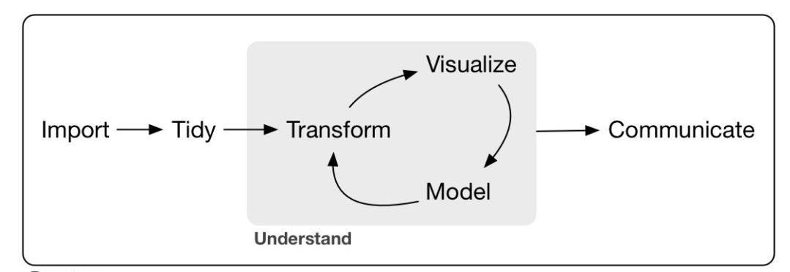
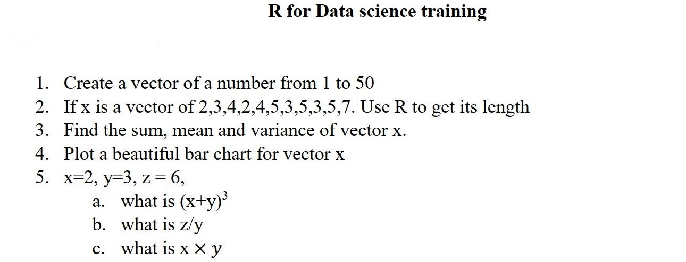
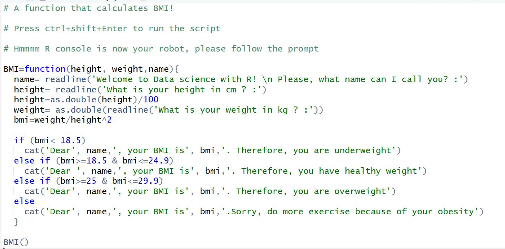

```{r setup, include=FALSE}
knitr::opts_chunk$set(echo = FALSE)
```

```{r library, include=F}
pg=c('tidyverse')
for(i in pg){
  library(i,character.only = T)
}
```


---
\begin{center}
\textbf{Relax, programming is cool!}
\end{center}

If you doubt me, please kindly ask Hadley Wickham, the Chief data scientist at R studio.

# R for Data Science

Data science is an exciting discipline that allows you to turn raw data into understanding, insight, and knowledge \cite{P}. The goal of R for Data Science is to help you learn the most important tools in R that will allow you to do data science. Data science is a huge field, and there's no way you can master it by
reading a single book \cite{P}. 

# What you will learn



## R and R Studio
R is a statistical programming language for data analysis and visualization while R Studio is an integrated development environment (IDE) for R programming. R Studio makes programming easier in R.

# R worth it 


# Introduction to R
In this chapter, you will take your first steps with R. You will learn how to use the console as a calculator and how to assign variables. You will also get to know the basic data types in R. Let's get started!

# Welcome to R programming


# R as a calculator
In its most basic form, R can be used as a simple calculator.
Consider the following arithmetic operations:

* Addition : 
* Subtraction : 
* Multiplication :
* Division : 
* Exponentiation: 
* Modulo : 

Calculate $6 + 12$

```{r, echo=TRUE}
6+12
```

Calculate $800-900$
```{r, echo=TRUE}
800-900
```

# R as a calculator
Calculate $4\times 5$ 
```{r, echo=TRUE}
4*5
```


Calculate $\frac{2018}{2}$

```{r, echo=TRUE}
2018/2
```

Calculate $2^3$

```{r, echo=TRUE}
2^3
```


# R as a calculator
Calculate $20\%\%3$

```{r, echo=TRUE}
20%%3
```
Calculate the square root of $\sqrt{4}$

```{r, echo=TRUE}
sqrt(4)
```

Calculate $(\sqrt{4})^2$

```{r, echo=TRUE}
(sqrt(4))^2
```


#Comment in R

R makes use of the # sign to add comments, so that you and others can understand what the R code is about. Just like Twitter! Comments are not run as R code, so they will not influence your result. For example, any code like $\#3 + 4$ at the console is a comment. R ignores any  code in #, this means that the code will not run.

```{r, echo=TRUE}
#3+4
```

# Variable assignment 

A basic concept in **statistical** programming is called a variable. A variable allows you to store a value (e.g. 5) or an object (e.g. a function description) in R. You can then later use this variable's name to easily access the value or the object that is stored with this variable.

## Example 
Store the value of 4 as your first name
```{r,echo=TRUE}
ezekiel=4
```

To know what is stored in memory as your first name, type your first name in the console and press return key from the keyboard

```{r,echo=TRUE}
ezekiel
```

# Variable assignment and data types in R

```{r,echo=TRUE}
x=3;y=4;z=10

x+y
z-x-y
x*y
z^x
```

# Naming Rules for Variables
The best naming convention is to choose a variable name that will tell the reader of the program what the variable represents

## Rules for naming variables

* All variables must begin with a letter of the alphabet.
* After the initial letter, variable names can also contain (_ or .) and numbers. No spaces or special characters, however are allowed.
* Uppercase characters are different from lowercase characters (in R and also in Python)

```{r, echo=F}
sample=tibble::tribble(
  ~`Samples of acceptable variable names`,~`Samples of acceptable variable names`,
'Grade', 'Grade(Test)',
'GradeOnTest', 'GradeTest#1',
'Gaudence_Uwimana','Gaudence Uwimana',
'sales_annex_2017','2017sales_annex')

```
## Example 

\begin{table}[ht]
\centering
\begin{tabular}{rll}
  \hline
& Samples of acceptable variable names & Uncceptable variable names \\ 
  \hline
1 & Grade & Grade(Test) \\ 
  2 & GradeOnTest & GradeTest\#1 \\ 
  3 & Gaudence\_Uwimana & Gaudence Uwimana \\ 
  4 & sales\_annex\_2017 & 2017sales\_annex \\ 
   \hline
\end{tabular}
\end{table}

# Basic classes of objects
R works with numerous \textbf{atomic} classes of objects. Some of the most basic atomic data types to get started are:

* Decimas values like 4.7 are called **numeric** 
* Natural numbers like 4 are called **integers**. Integers are also numeric
* Boolean values (**TRUE** or **FALSE**) are called **logical**
* Text (or string) values are called **characters**
* Factors : Categorical variable where each level is a category
 
# Basic data structure or types

1. Vector :  A collection of elements of the same class
1. Matrix : All columns must uniformly contain only one variable type
1. data.frame : The columns can contain different classes
1. List : Can hold object of different classes and lenght

# Create a vector

Vectors are one-dimensional arrays that can hold numeric data, character data, or logical data. In R, you can create a vector with the combine function \textbf{c()}. You place the vector elements separate by a comma between the parenthesis.

## For example
numeric_vector <- c(1, 2, 3, 6, 7, 10) 

character.vector <- c('Bosco', 'Lucie', 'John', 'Agness', 'Marc')

## Notice
Adding a space behind the commas in the \textbf{c()} function improves the readability of your code

## Naming a vector
As a data analyst, it is important to have a clear view on the data that you are using. Understanding what each element refers to is essential. You can give  a name to the elements of a vector with the \textbf{names ()} function

# Create a vector 
## Example

```{r, echo=T}
sales_tax <- c(140000, 200000, 600000, 180000, 170000)
names(sales_tax) <- c('Monday','Tuesday','Wednessday',
                      'Thursday','Friday')
sales_tax
```

# Arithmetic with vectors

It is important to know that if you sum two vectors in R, it takes the element-wise sum

## Example
```{r, echo=T}
a <- c(1, 2, 3, 4, 5)
b <- c(6, 7, 8, 9, 10)
c <- a + b
```

```{r,echo=T}
c
```

# Vector selection

To select elements of a vector (and later matrices, data frames), you can use square brackets [ ], between the square brackets, you indicate what elements to select.

To select the first elements of  vector \textbf{a}, you type \textbf{a}[1]. 

To select the second element of the vector, you typed \textbf{a}[2], etc.

## Example
```{r, eval=F, echo=T,collapse=T}
a
a[1]
a[2]
```
# Short group work
## What does it do?
a[a>3]

## Create special vectors 
```{r, echo=T}
a= 1: 10 # Create sequence 1 to 10
b= 10:1 # Create sequence 10 to 1
```

To create sequence with increament of 2 from 1 to 16, we can \textbf{seq()} function e.g.
```{r, eval=F, echo=T}
seq(1, 16, 2)
seq(1, 20, 0.1)
seq(20, 1, -0.1)
```

# Create special vectors cont.
If you have a sequence value you don't know the last element, say you just know the start of the sequence and the length of the sequence, e.g.

```{r,eval=F,echo=T}
seq(5, by=2, length=50)
length(seq(5, by=2, length=50))
```

Repeating elements for certain number of time
```{r, echo=T, eval=F}
rep(5, 10) # Repeat 5 in 10 times
rep(1:4, 5) # Repeat 1 to 4 five times
rep(1:4, each=3) # Each element of 1 to 4 3 times

```

# Short group work
## Tell what the following line of codes is or are doing
```{r, echo=T, eval=F}
rep(1:4, each=3, time=2)
rep(1:4, 1:4)
rep(1:4, c(4,1,8,2))
```

# Assignment 1


# Some fun- Using R to print out the Body Mass Index



# Matrices
In R, a matrix is a collection of elements of the same data type (numeric, character, or logical) arranged into a fixed number of rows and columns.

Since we are only working with rows and columns, a matrix is called two dimensional array.

You can construct a matrix in R with the \textbf{matrix ()} function.

## Example
```{r, eval=T,echo=T, collapse=T}
A <- matrix(1:9, nrow = 3, byrow = T); A
```

# Matrices
* The first argument is the collection of elements that #Rstats will arrange into the rows and columns of the matrix. Here, we use 1:9 which is a shortcut for c(1, 2, ..., 9). 
* The arguement \textbf{byrow} indicates that the matrix is filled by the rows. If we want the matrix to be filled by the columns, we just place \textbf{byrow=F}
* The argument \textbf{nrow} indicates that the matrix should have 3 \textbf{rows}

# Short group work
Construct a matrix with 3 rows containing the numbers 1 up to 9 filled \textbf{column-wise}

# Progressing from vector to matrix
```{r,echo=T, eval=T}
fiscal_year2016_17 <- c(140, 134)     
fiscal_year2017_18 <- c(160, 158)  
performance_analysis <- matrix(c(fiscal_year2016_17,
                        fiscal_year2017_18),nrow = 2, 
                        ncol = 2,byrow = T)
performance_analysis
```


# Naming a matrix
To help you understand what is stored in the performance analysis matrix, it is good to add the names of the rows and columns respectively. Not only does this help you to read the data, but it also useful to select certain elements from the matrix.


```{r, echo=T, eval=T}
rownames(performance_analysis) <-
  c('Fiscal year July-June 2016/17',
   'Fiscal year July-June 2017/18')
colnames(performance_analysis) <- c('Actual', 'Target')
performance_analysis
```


# Other examples

```{r, echo=T, eval=T}
A <- matrix(c(1, 3, 5, 7, 9, 11, 13, 15, 17), ncol = 3, 
            byrow = F); A
```

```{r,echo=T, eval=T}
B <- matrix(c(2,4,6,8,10,12,14,16,18), ncol = 3, 
            byrow = F); B
```

# Matrices selection

To select elements in a matrix we can use square brackets [ , ], between the square brackets, you indicate the position of the row and column in which the elements to select are.

To select the element in the first row and second column of matrix \textbf{A}, you type \textbf{A}[1,2]. 

To select the element in the third row and second column of matrix \textbf{A}, you type \textbf{A}[3,2], etc.

## Example
```{r, eval=F, echo=T,collapse=T}
A
A[1,2]
A[3,2]
```

# Arithmetic Operation
We can perform all the arithmetic operations on matrices

* Addition

```{r,echo=T, eval=T}
C <- A + B; C
```
* Subtraction

```{r,echo=T, eval=T}
D <- B - A; D
```

# Arithmetic Operation
## Multiplication
```{r,echo=T, eval=T}
F <- A  %*%  B; F
```

# Arithmetic Operation

* Transpose

\begin{align*}
G=t(A)=\begin{pmatrix}
1&7&13\\
3&9&15\\
5&11&17
\end{pmatrix}\end{align*}

```{r,echo=T, eval=T}
G <- t(A); G
```


# Arithmetic Operation

* Determinant

\begin{align*}
G=det(A)=\begin{vmatrix}
1&7&13\\
3&9&15\\
5&11&17
\end{vmatrix}\end{align*}

```{r,echo=T, eval=T}
G <-det(A); G
```

# Arithmetic Operation

## Inverse

For inverse, we use \textbf{solve()} a base function in R

H <- solve(B)

H

# Did you encounter a problem?
Be of good cheer; for I have overcome the world!- Jesus Christ in  John 16:33


# Inverse function to tackle the problem
```{r, eval=T, echo=T }
inverse <- function(A){
  if (det(A)<0.01)
   cat("Since the given matrix is singular. 
       Sorry, I can't find inverse")
  else 
    solve(A)
  }

```
```{r, eval=T, echo=T }
inverse(A)
```

# Short group work
Use the function that you wrote to find the inverse of matrix J, where J is:

\begin{align*}
J=\begin{pmatrix}
5& 1&    0\\
3&   -1&    2\\
4&    0 &  -1
\end{pmatrix}\end{align*}

## Note

Assign the matrix to J and call inverse(J) in \textbf{R}

# Short group work

Can you also confirm it with the base function \textbf{solve(J)}?
```{r, echo=T, eval=F}
solve(J)
```

Are they the same? Try it with this \textbf{R-code}
```{r,echo=T,eval=F}
inverse(J)==solve(J)
```

# System of linear equation

We can use matrix skills to solve any system of linear equations

## Solve the following system of equations

\begin{align*}
x-y &= 3\\
2x +3y &= -4
\end{align*}

## Matrices preparation

\begin{align*}
A=\begin{pmatrix}
1&-1\\
2&3
\end{pmatrix}\quad B=\begin{pmatrix}
x\\
y
\end{pmatrix} \quad C=\begin{pmatrix}
3\\
-4
\end{pmatrix}
\end{align*}

\begin{align*}
B= A^{-1}\times C
\end{align*}

# Coding in R
```{r, eval=T, echo=T}
A=matrix(c(1,-1,2,3),nrow = 2,byrow = T)
A
C=matrix(c(3,-4),nrow = 2, byrow = T)
C
```
# Coding in R
```{r, eval=T, echo=T}
B=solve(A)%*%C
B
x = B[1,1]; x
y = B[2,1]; y
```


# Eigenvalues and Eigenvectors

Consider the following matrix 

\begin{align*}
B = \begin{pmatrix}
1 & -6\\
3 &   -8
\end{pmatrix}\end{align*}

1. Determine the eigenvalues of $B$
2. Determine the eigenvectors corresponding to each eigenvalue of $B$

## Solution

```{r,echo=T, eval=T}
B <- matrix(c(1,-6, 3, -8), nrow = 2, ncol = 2, byrow = TRUE)
print(B) # To see the matrix
```

# Eigenvalues and Eigenvectors

The function for calculating `eigenvalues` is `eigen()`. Note the function `eigen()` will produce a list as results. You will soon know what a `list()` is in the next chapter of this book.

```{r,echo=T, eval=T}
eigen(B)
```

# Short group work

Consider the following matrix 

\begin{align*}
B = \begin{pmatrix}
4 & 5& -5\\
0 & 4& 1\\
0 & 1& 2
\end{pmatrix}\end{align*}

1. Determine the eigenvalues of $B$
2. Determine the eigenvectors corresponding to each eigenvalue of $B$

# Dataframe

Dataframes are another way to put data in tables! Unlike matrices, dataframes can have different types of data!

A dataframe has the variables of a data set as `columns` and the observations as `rows`. This will be a familiar concept for those coming from different statistical software packages such as `Excel`, `SPSS`, or `STATA`

The function for dataframe is `data.frame()`.

# Example

```{r, echo=T, eval=T}
# Make a dataframe with columns named a and b
data.frame(a = 2:4, b = 5:7)
```

The numbers `1 2 3` at the left on your `console` are `row` labels and are not a `column` of the dataframe

Each column in a dataframe is a vector!

# Dataframe

## Example
a= c(6, 5, 1)

b= c(1, 1, 3)

data=data.frame(a,b) `#` The output is

data


## Group work

Create a dataframe and call it `data` for the following vectors:

```{r, echo=T}
height <- floor(rnorm(n=100,mean = 135, sd=12))
weight <- ceiling(rnorm(n=100, mean = 55, sd=9))
```

# Quick, have a look at your dataset

Working with large datasets is common in data science. When you work with (extremely) large datasets and dataframes, your first task as a data analyst  is to develop a clear understanding of its structure and main elements. Therefore, it is often useful to show only part of the entire dataset.

1. `head()`: enables you to show the first observations of a dataframe.

2. `tail()`: enables you to print out the last observations in your dataset.

Both `head()` and `tail()` print a top line called `header`, which contains the names of the different variables in your data set.

# Have a look at the structure

Another method that is often used to get a rapid overview of your dataset is the function `str()`. 

3. `str()`: Shows you the structure of your dataset 

The structure of a dataframe tells you :

1. The total number of observations
2. The total number of variables
3. A full list of the variables names
4. The first observations

## Note

Applying the `str()` function will often be the first thing that you do when receiving a new dataset or dataframe. It is a great way to get more insight in your dataset before diving into the real analysis.

# Example

Considering these vectors:
```{r, echo=T}
height <- floor(rnorm(n=120,mean = 135, sd=12))
weight <- ceiling(rnorm(n=120, mean = 55, sd=9))
```

Create a `dataframe` for it.

```{r, echo=T}
data <- data.frame(height, weight)
```
```{r, echo=T}
str(data)
```

# Example
```{r, echo=T}
head(data, 5)
tail(data,3)
```

# Using built-in datasets in R

There are several ways to find the included datasets in R.

Using `data()` will give you a list of the datasets of all loaded packages.

## Example
`#` This shows the library in which datasets are stored.

data()  

## Example

library(datasets)

data <- airquality

str(data)

To get help in the proper description of the dataset `?airquality`


# References
\begin{thebibliography}{99}
\bibitem {P} 
Wickham, H., \& Grolemund, G. (2016). R for data science: import, tidy, transform, visualize, and model data. " O'Reilly Media, Inc.".
\end{thebibliography}
